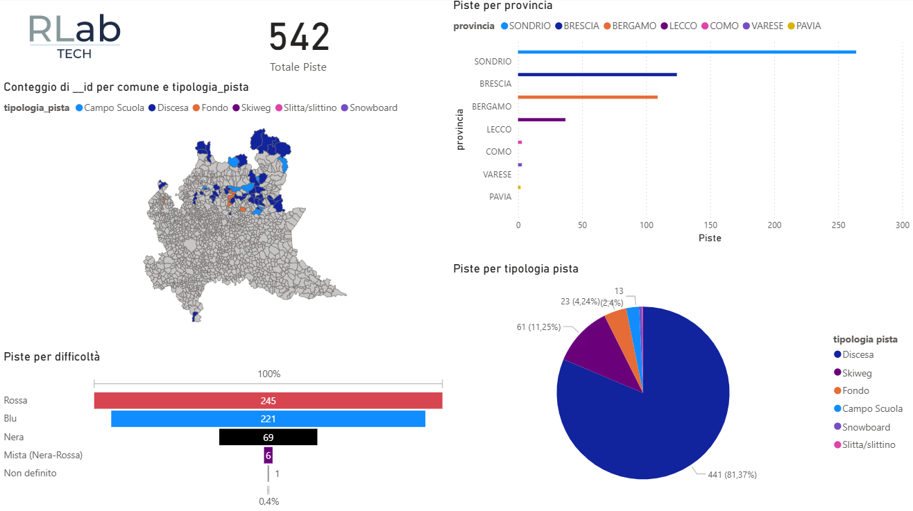
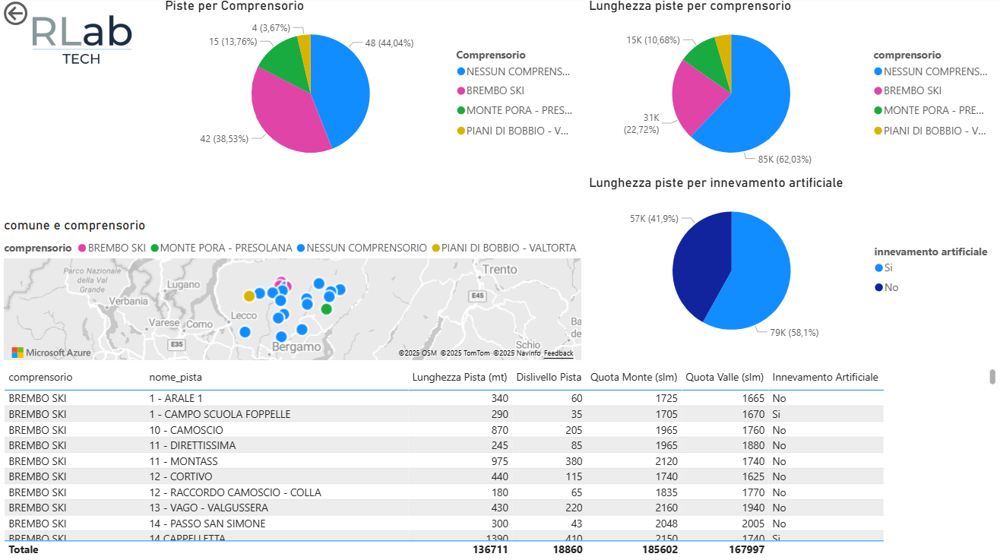
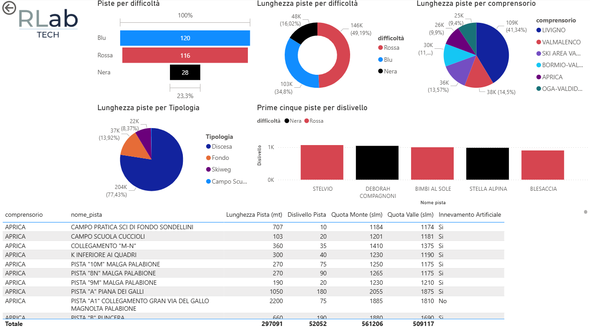

# Dashboard Piste da Sci - Regione Lombardia

Questa dashboard realizzata in **Power BI** analizza i dati pubblici relativi alle piste da sci della Regione Lombardia.  
L'obiettivo è fornire una panoramica intuitiva e interattiva delle informazioni su comprensori, gestori, caratteristiche tecniche e distribuzione territoriale delle piste.
---

## Contenuti principali

### 📊 Indicatori chiave (KPI)
- Numero totale di piste censite
- Lunghezza delle piste (km)
- Dislivell
- Quota media di monte e di valle
- Piste con innevamento artificiale
- Distribuzione per tipologia (sci alpino, fondo, ecc.)

### 🗺️ Mappe interattive
- Localizzazione georeferenziata delle piste su mappa
- Filtri per provincia, comune e comprensorio
- Evidenziazione dei comprensori principali

### 🔎 Approfondimenti (Drill-through)
- Dettaglio per comprensorio
- Analisi piste

### Anteprima

---

## Utilizzo
1. Aprire il file `.pbix` con Power BI Desktop oppure pubblicare su Power BI Service.
2. Utilizzare i filtri laterali per esplorare i dati.
3. Cliccare su una provincia/comprensorio per accedere ai dettagli (drill-through).

---

## Fonti dati
I dati provengono dal portale [Dati Lombardia](https://www.dati.lombardia.it/Sport/Piste-da-sci/8c8w-y5ce/about_data), dataset ufficiale relativo alle **piste da sci** regionali.
